# GreetKart E-commerce Use Case Diagram

```mermaid
graph TD
    subgraph "GreetKart E-commerce System"
        subgraph "Customer Management"
            UC1[Register Account]
            UC2[Login/Logout]
            UC3[View Profile]
            UC4[Update Profile]
            UC5[Change Password]
        end

        subgraph "Product Management"
            UC6[Browse Products]
            UC7[Search Products]
            UC8[View Product Details]
            UC9[Filter by Category]
            UC10[View Product Reviews]
            UC11[Add Product Review]
        end

        subgraph "Shopping Cart"
            UC12[Add to Cart]
            UC13[View Cart]
            UC14[Update Cart Quantity]
            UC15[Remove from Cart]
            UC16[Select Product Variations]
        end

        subgraph "Order Management"
            UC17[Proceed to Checkout]
            UC18[Enter Shipping Address]
            UC19[Select Payment Method]
            UC20[Place Order]
            UC21[View Order History]
            UC22[Track Order Status]
            UC23[Cancel Order]
        end

        subgraph "Payment Processing"
            UC24[Process Payment]
            UC25[View Payment Status]
            UC26[Generate Invoice]
        end

        subgraph "Admin Functions"
            UC27[Manage Users]
            UC28[Manage Categories]
            UC29[Add Product]
            UC30[Edit Product]
            UC31[Delete Product]
            UC32[Manage Inventory]
            UC33[View All Orders]
            UC34[Update Order Status]
            UC35[Generate Reports]
            UC36[Manage Product Variations]
            UC37[Approve/Reject Reviews]
        end
    end

    %% Actors
    Customer((Customer))
    Guest((Guest))
    Admin((Admin))

    %% Customer Use Cases
    Customer --> UC1
    Customer --> UC2
    Customer --> UC3
    Customer --> UC4
    Customer --> UC5
    Customer --> UC6
    Customer --> UC7
    Customer --> UC8
    Customer --> UC9
    Customer --> UC10
    Customer --> UC11
    Customer --> UC12
    Customer --> UC13
    Customer --> UC14
    Customer --> UC15
    Customer --> UC16
    Customer --> UC17
    Customer --> UC18
    Customer --> UC19
    Customer --> UC20
    Customer --> UC21
    Customer --> UC22
    Customer --> UC23
    Customer --> UC24
    Customer --> UC25
    Customer --> UC26

    %% Guest Use Cases (limited functionality)
    Guest --> UC6
    Guest --> UC7
    Guest --> UC8
    Guest --> UC9
    Guest --> UC10
    Guest --> UC12
    Guest --> UC13
    Guest --> UC14
    Guest --> UC15
    Guest --> UC16
    Guest --> UC17
    Guest --> UC18
    Guest --> UC19
    Guest --> UC20
    Guest --> UC24
    Guest --> UC25
    Guest --> UC26

    %% Admin Use Cases
    Admin --> UC27
    Admin --> UC28
    Admin --> UC29
    Admin --> UC30
    Admin --> UC31
    Admin --> UC32
    Admin --> UC33
    Admin --> UC34
    Admin --> UC35
    Admin --> UC36
    Admin --> UC37

    %% Include relationships
    UC17 -.-> UC18
    UC17 -.-> UC19
    UC17 -.-> UC20
    UC20 -.-> UC24
    UC24 -.-> UC25
    UC24 -.-> UC26

    %% Extend relationships
    UC8 -.-> UC11
    UC8 -.-> UC12
    UC13 -.-> UC14
    UC13 -.-> UC15
    UC21 -.-> UC22
    UC21 -.-> UC23
    UC29 -.-> UC36
    UC30 -.-> UC36
```

## Use Case Descriptions

### Customer Management

- **Register Account**: New users can create an account with email, username, and personal details
- **Login/Logout**: Authenticated users can sign in and out of the system
- **View Profile**: Users can view their account information and profile
- **Update Profile**: Users can modify their personal information and address
- **Change Password**: Users can update their account password

### Product Management

- **Browse Products**: View all available products in the store
- **Search Products**: Find specific products using search functionality
- **View Product Details**: See detailed information about a specific product
- **Filter by Category**: Browse products by category
- **View Product Reviews**: Read reviews and ratings for products
- **Add Product Review**: Write and submit reviews for purchased products

### Shopping Cart

- **Add to Cart**: Add products to shopping cart
- **View Cart**: See all items in the shopping cart
- **Update Cart Quantity**: Modify quantities of items in cart
- **Remove from Cart**: Delete items from shopping cart
- **Select Product Variations**: Choose size, color, or other variations

### Order Management

- **Proceed to Checkout**: Start the checkout process
- **Enter Shipping Address**: Provide delivery address information
- **Select Payment Method**: Choose payment option (COD, online payment)
- **Place Order**: Confirm and submit the order
- **View Order History**: See all past orders
- **Track Order Status**: Check current status of orders
- **Cancel Order**: Cancel orders before processing

### Payment Processing

- **Process Payment**: Handle payment transactions
- **View Payment Status**: Check payment confirmation
- **Generate Invoice**: Create order invoices

### Admin Functions

- **Manage Users**: View, edit, and manage user accounts
- **Manage Categories**: Create, edit, and delete product categories
- **Add Product**: Create new products in the system
- **Edit Product**: Modify existing product information
- **Delete Product**: Remove products from the store
- **Manage Inventory**: Update product stock levels
- **View All Orders**: Access complete order information
- **Update Order Status**: Change order processing status
- **Generate Reports**: Create sales and inventory reports
- **Manage Product Variations**: Handle product sizes, colors, etc.
- **Approve/Reject Reviews**: Moderate product reviews

## Actor Descriptions

### Customer

- Registered users who can perform all shopping and account management functions
- Can place orders, manage profile, and write reviews

### Guest

- Unregistered visitors with limited functionality
- Can browse products and place orders without registration
- Cannot access order history or write reviews

### Admin

- System administrators with full access to all management functions
- Can manage products, users, orders, and system settings
